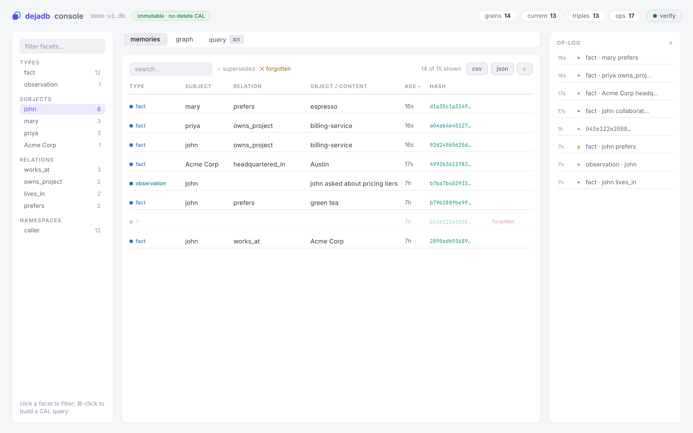
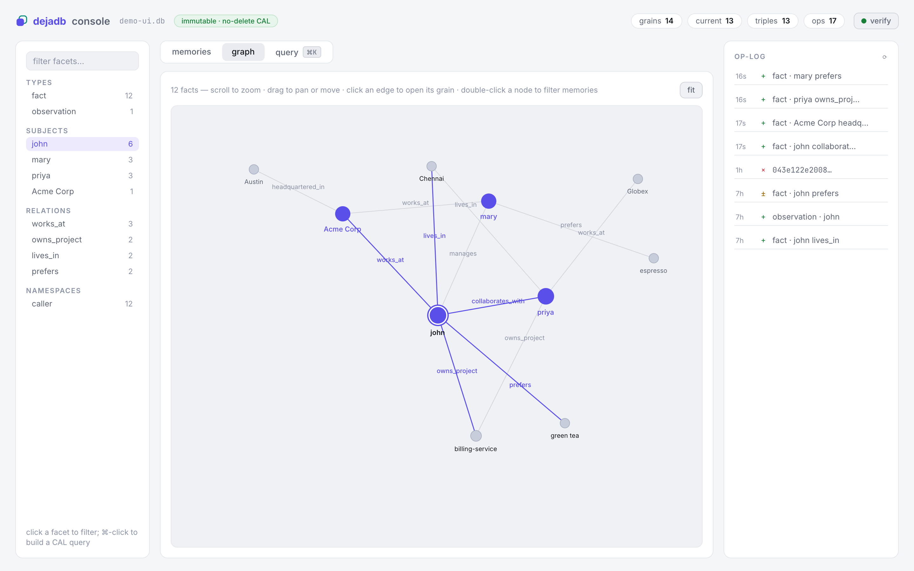
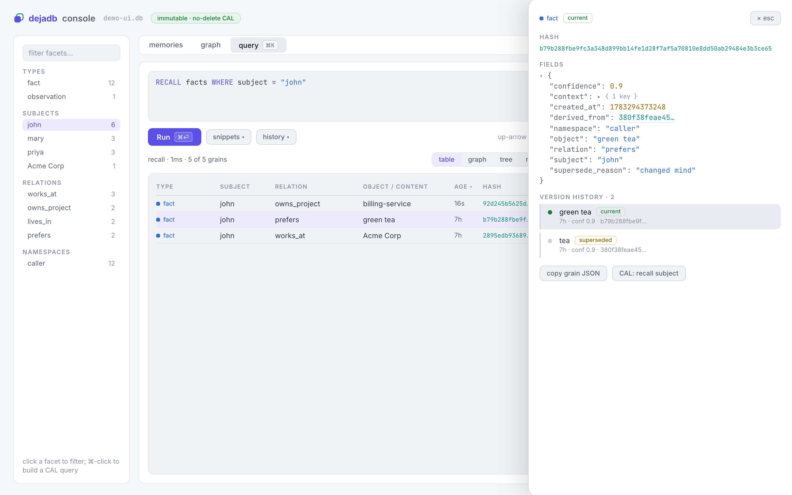

# DejaDB

> 中文 · [English](README.md)

**面向 AI 智能体的嵌入式记忆引擎** —— 不腐化、不过期、每条事实都能证明来源的记忆。

[](https://github.com/AreevAI/dejadb/actions/workflows/ci.yml)
[](#license)
[](#install)

*名字取自 **déjà vu**（既视感）—— 法语意为"已经见过"。这正是记忆之于智能体的
意义：认出它此前遇到过的东西。*

进程内嵌入，把记忆存为不可变的内容寻址 (content-addressed) grain，用 CAL（上下文
组装语言，Context Assembly Language）查询，结果直接交给模型 —— 召回路径上没有
服务器、没有 sidecar、没有网络跳转。**微秒级召回** —— 快到能在实时**语音智能体**
的一轮对话中完成，而网络记忆调用做不到。**你的智能体记忆，就是一个你自己拥有的文件。**

> 给智能体记忆的 git：日志 (log)、差异 (diff)、时间回溯、带显式合并的分叉，
> 以及加密增量同步 —— 全部内建于数据模型之中，因为 grain *本身就是*
> 内容寻址的不可变对象。

*状态：`1.0.0` —— `.mg` 格式与 CAL 已稳定并有完整文档（符合开放记忆规范
Open Memory Spec，OMS）。已构建并测试；尚未发布到 crates.io / PyPI / npm。*

## 截图

Web 控制台 —— 浏览记忆、查看图谱、运行 CAL 并实时检视 grain（点击放大）：

<p align="center">
  <a href="demo/screens/memories.png"></a>
  <a href="demo/screens/graph.png"></a>
  <a href="demo/screens/query.png"></a>
</p>

## 为什么

如今的智能体记忆，无非是向量库加上一条抽取流水线 —— 而经过审计的部署一再
暴露同一种故障：存储被重复项和无人能溯源的陈旧值填满。
DejaDB 是另一种形态：一个**由你嵌入的引擎**，从结构上让记忆*无法*静默腐化。

- **不会腐化 —— 实测而非承诺**：记忆是不可变的内容寻址 grain，字节相同的
  重复写入会坍缩为**一个** grain；更新是版本演替 (supersession)，召回只返回
  **1 个当前值、0 个陈旧值**，完整历史全部保留；**100%** 的 grain 都能追溯
  到它何时、如何进入。全部确定性验证、无需 LLM：
  `cargo run -p dejadb-bench --bin honesty_metrics`。
- **让会学习的智能体安全学习**：在自我改进回路里，腐化会*复利式放大* ——
  抱着陈旧经验和重复项的学习型智能体会越学越差。版本演替（修订会替换，
  绝不并列）、结构化链接到来源经历的教训、可幂等重放的同步，以及对记忆
  文件的时间点回滚，让整条学习回路可审计、可逆转：
  [构建一个会学习的智能体](docs/cookbook.md#10-build-an-agent-that-learns-and-can-unlearn)。
- **CAL 原生**：`RECALL` / `ASSEMBLE` / `EXISTS` / `HISTORY` / `ADD` /
  `SUPERSEDE` —— 一门没有批量销毁能力的查询语言：`DELETE` 和 `DROP`
  压根不是语法里的 token，唯一的破坏性语句 `FORGET <hash>`（单 grain 墓碑）
  受执行门控，且可整进程禁用。
- **在关键处够快**（实测，Apple M4 Max）：结构化召回 **~28µs**，
  `entity_latest` **~7µs**，带实时写回的 50ms 帧率语音回路每帧召回
  **72µs p50 / 153µs p99**。
- **混合召回**：结构化 + BM25 + 向量三路，用 RRF 融合；天生多语言
  （阿拉伯语和英语在每一路都能命中；无空格的 CJK 走向量一路）。
  向量模型任你接入：Rust 用 `EmbedBackend` trait，Python 用回调
  （`set_embedder`），所有表面都可用命令方式
  （`--embed-cmd 'my-embedder'` —— stdin 进文本，stdout 出 JSON 向量）。
- **以 git 的方式做分布式**：带 generation 的 op-log 流式传输与时间点恢复；
  面向车队的知识分发订阅；并发编辑会变成**带确定性临时头 (provisional head)
  的分支** —— 显式呈现、显式合并，绝不静默丢失。
- **隐私优先设计**：本地优先、无遥测；可选的 **AES-256-GCM 静态加密**，
  密钥由 Argon2id 派生；删除是一个墓碑 (tombstone) 或**加密擦除 (crypto-erasure)**
  （销毁密钥，即销毁记忆）。参见 [安全](#security--privacy)。
- **模型原生**：内建 MCP 服务器、[Anthropic memory-tool
  后端适配器](docs/memory-tool.md)、预算感知的上下文渲染
  （SML / Markdown / TOON / JSON）、面向 9 种厂商格式的工具 schema 渲染、
  Python 与 Node 绑定。
- **格式归你所有，迁入有铺好的路**：`.mg` 格式完整成文，并与
  [OMS](https://github.com/openmemoryspec/oms) 规范一致（字节级测试向量），
  你的记忆比引擎活得更久 —— 而 [`deja migrate`](docs/migrate.md) 能把你
  现有的记忆导入进来：**mem0**（完整编辑历史保留为版本演替链）、
  **Zep/Graphiti**、**Letta**、**LangMem/LangGraph**、**Basic Memory**，
  或任意存储经由通用 JSONL。

## 安装

DejaDB 尚处于预发布阶段，因此目前请从源码安装（需 Rust 1.90+）：

```bash
git clone https://github.com/AreevAI/dejadb
cd dejadb
cargo build --release                       # builds the `deja` binary
./target/release/deja --help
# or install the CLI onto your PATH:
cargo install --path crates/dejadb-cli
```

Python 绑定通过 [maturin](https://github.com/PyO3/maturin) 构建，Node 绑定通过
[napi-rs](https://napi.rs) 构建：

```bash
pip install maturin && maturin develop -m crates/dejadb-py/Cargo.toml
cd crates/dejadb-js && npm ci && npm run build     # Node 原生插件
```

已发布到 `crates.io`、`PyPI`（`pip install dejadb`）和 `npm` 的软件包均已预留名称，
将随 `1.0.0` 版本一同上线。

## 快速开始（CLI）

存一条事实、召回它、交给模型 —— 三条命令，毫无仪式感
（`--db` 可省略；它会回退到 `$DEJADB_DB`，再回退到 `~/.dejadb/default.db`）：

```bash
deja add    john prefers "window seat"     # 主语 谓语 宾语
deja recall john                           # → window seat
deja recall john --render sml              # 模型就绪的上下文块
```

要指定具体文件，用 `-d mem.db`（或 `export DEJADB_DB=mem.db`）。
再深入：`deja cal '<QUERY>'` 执行查询语言，`deja ui` 打开 Web 控制台
（http://127.0.0.1:7437），`deja repl` 是交互式 CAL 终端。

### 给 Claude Code（或任意 MCP 客户端）加上持久记忆

```bash
claude mcp add deja -- deja serve --mcp --db ~/.dejadb/code.db --ns claude-code
```

`deja serve --mcp` 在 stdio 上讲以换行分隔的 JSON-RPC 2.0，可与任意 MCP
客户端配合使用 —— 参见 [`docs/mcp-reference.md`](docs/mcp-reference.md)。

### 已经在用 mem0、Zep、Letta 或 LangMem？

把你的记忆连同编辑历史一起带过来：

```bash
deja migrate --from mem0 --file export.json --history history.json --db mine.db
deja migrate --from basic-memory --file ~/basic-memory --db mine.db
```

mem0 的历史事件会重放为真正的版本演替链（ADD → add、UPDATE → supersede、
DELETE → forget），并保留**原始时间戳**，`HISTORY` 能看到导入前的演化轨迹；
笔记形态的来源会落成 `/memories` 下可直接编辑的 memory-tool 文件。
重复运行导入会跳过已有内容。各来源的导出一行命令见
[`docs/migrate.md`](docs/migrate.md)。

### 构建一个会学习 —— 也能“反学习”的智能体

在自我改进回路中，记忆腐化会*复利式放大*：一个不断重复学习、抱着陈旧经验
不放的智能体不是停滞，而是越来越差。DejaDB 的写入路径正是这条回路的安全
机制 —— 记录原始经历，把提炼出的教训存为 fact，把熟练度做成一条版本
演替链：

```bash
deja remember --observer executor --content "Attempt 2: isolated the tempdir per test - PASSED."
deja cal 'ADD fact SET subject = "fix_flaky_tests" SET relation = "lesson"
  SET object = "Shared tempdirs need per-test isolation." REASON "distilled from session 41"'
deja cal 'HISTORY WHERE subject = "fix_flaky_tests" AND relation = "proficiency"'  # 学习曲线
deja restore --db rewound.db --from ./checkpoints --until-hlc <T>  # 回滚一次糟糕的学习
```

反思（提炼教训）是你自己的模型调用 —— DejaDB 从不运行 LLM。它保证的是：
修订后的经验会*替换*旧值而非与之并列，每条教训经 `derived_from` 结构化
链接到教会它的那次经历，同步/重放的写入不会重复入库，而一次糟糕的学习
可用时间点恢复回退（先建检查点 —— 配方里有完整流程）。即使是*换个措辞的
重复学习*也能拦下：`deja novelty` 报告最相近的既有教训，让 harness 用
SUPERSEDE 修订而不是新增近似重复项（仅建议，绝不自行丢弃写入）。完整回路见
[cookbook §10](docs/cookbook.md#10-build-an-agent-that-learns-and-can-unlearn)。

### Python

```python
import dejadb, json
m = dejadb.DejaDB("john.db", ns="caller")
m.add_fact("john", "prefers", "tea", confidence=0.95)
m.cal('RECALL facts WHERE subject = "john"')
m.memory_tool(json.dumps({"command": "view", "path": "/memories"}))  # Anthropic memory-tool backend
```

### 静态加密

```bash
export DEJADB_KEY="correct horse battery staple"
deja add --db secret.db --ns caller --subject john --relation prefers \
  --object "window seat" --passphrase-env DEJADB_KEY   # AES-256-GCM, Argon2id key
```

### 持久性与车队

```bash
deja stream  --db john.db --to  s3-mounted/john/     # continuous op-log shipping (~Litestream, grain-level)
deja restore --db new.db  --from s3-mounted/john/ [--until-hlc T]   # incl. point-in-time
deja follow  --db org-replica.db --from org-pub/     # subscribe: org knowledge → every edge
deja verify  --db john.db                            # integrity + full content-address recheck
```

一个记忆 = 一个文件：它是擦除（加密擦除 = 销毁密钥）、同步、可移植性和写入并行的
基本单位。按用户、组织、类别还是会话来分区，随你决定。

## 基准测试

可复现的测试工具位于 `crates/dejadb-bench` —— 完整方法论与原始数据见其
[`RESULTS.md`](crates/dejadb-bench/RESULTS.md)；已提交的运行记录见
[`results/`](crates/dejadb-bench/results)。

**记忆质量 —— [LoCoMo](https://github.com/snap-research/locomo)**（10 段对话、
5,882 轮、1,982 个问答），采用一条朴素的“先检索后阅读”流水线，未做任何任务专属调优：

| 检索环节 | DejaDB |
|---|---|
| hit@10 / hit@20 —— OpenAI `text-embedding-3-small` | **74.5% / 81.6%** |

端到端答案准确率为 **54.2%**（全部 1,982 个问答；gpt-4o-mini 阅读器，gpt-4o 评判，
k=20）—— 这是一个廉价、未调优的阅读器叠加在上述检索之上，瓶颈在阅读器而非召回，
换用更强的阅读器即可提升。自带你自己的模型（`$DEJADB_LLM_CMD` / `$DEJADB_JUDGE_CMD`）
和向量模型（`EmbedBackend` trait；即便是无需 API 的 TF-IDF 下限也能拿到 40.7% 的 hit@10）。
每一条答案和评判裁决都已提交以备审计 —— 这个领域历来充斥着无法复现的宣称，
所以我们把凭据一并公开：
[运行记录](crates/dejadb-bench/results/locomo-gpt-4o-mini-k20-2026-07-07.transcripts.jsonl)
（[摘要](crates/dejadb-bench/results/locomo-gpt-4o-mini-k20-2026-07-07.summary.json)）。

**记忆完整性 —— 诚实度指标**（结构化、确定性、无 LLM 参与）：
字节完全相同的写入会收敛为**一个 grain**（导入、同步重放与重试因此幂等；
换措辞的去重由宿主承担）；20 次更新之后，召回返回**1 个当前值、0 个陈旧值**，
且完整保留历史；写入成本约 **~136µs、0 次 LLM 调用**（文本索引关闭或延迟时；
实时 FTS 索引每次写入另加约 140ms —— 见 RESULTS.md 发现 #1）；**100%** 的
grain 都能溯源到它们何时、如何进入。
`cargo run -p dejadb-bench --bin honesty_metrics`。

**延迟**（Apple M4 Max）—— 让“嵌入式引擎”区别于记忆*服务*的那几微秒：

| 召回操作 | p50 | p99 |
|---|---|---|
| `entity_latest`（进程内） | **~7 µs** | — |
| 结构化召回（进程内） | **~28 µs** | — |
| 50ms 语音帧内、实时写回 | **72 µs** | 153 µs |
| 同一召回经 localhost HTTP 边车 | 158 µs | 264 µs |
| 同一召回经 MCP stdio（智能体宿主） | 129 µs | 205 µs |

上表每一种方式都落在 50ms 音频帧的 0.6% 以内；两行传输开销表明成本在网络跳转、
而非存储本身 —— 这正是把它嵌入进程的全部理由。

## 文档

| 文档 | 用途 |
|---|---|
| [`ARCHITECTURE.md`](ARCHITECTURE.md) | DejaDB 的工作原理：grain、`.mg` 格式、CAL、召回、同步 |
| [`docs/cal-reference.md`](docs/cal-reference.md) | CAL 查询语言参考 |
| [`docs/mcp-reference.md`](docs/mcp-reference.md) | MCP 服务器及其 6 个工具 |
| [`docs/migrate.md`](docs/migrate.md) | 从 mem0、Zep、Letta、LangMem、Basic Memory、JSONL 迁移 |
| [`docs/memory-tool.md`](docs/memory-tool.md) | Anthropic memory-tool 后端（Python / Node / CLI） |
| [`docs/cookbook.md`](docs/cookbook.md) | 面向任务的实用配方 |
| [`FAQ.md`](FAQ.md) | 常见问答（也对 LLM 友好） |
| [`SECURITY.md`](SECURITY.md) · [`docs/security-model.md`](docs/security-model.md) | 安全策略与威胁模型 |
| [`AGENTS.md`](AGENTS.md) · [`llms.txt`](llms.txt) | 面向在本仓库中 / 借助本仓库工作的 AI 智能体 |
| [`CONTRIBUTING.md`](CONTRIBUTING.md) | 如何贡献（DCO 签署） |

## 安全与隐私

DejaDB 本地优先，且不收集任何遥测数据。可选的 **AES-256-GCM 静态加密**
保护数据库（密钥经由 Argon2id 从口令派生）；删除一条记忆是一个墓碑 (tombstone)
或**加密擦除 (crypto-erasure)**。Web 控制台按设计绑定到回环地址且不带任何鉴权，
未经明确选择加入，绝不会把自己暴露到网络上。

在把它部署到本地机器之外之前，请先阅读那份坦诚的 [威胁模型](docs/security-model.md)，
并依据我们的 [安全策略](SECURITY.md) 报告漏洞 —— **请不要为漏洞开公开 issue**。

## 工作区

| Crate | 说明 |
|---|---|
| `dejadb-core` | `.mg` 格式、规范化序列化、内容寻址、11 种 grain 类型、工具 schema 渲染 |
| `dejadb-store` | 基于 Turso 的存储：字典编码三元组、混合召回、head/fork、blob (CAS)、bundle/流式传输、memory-tool 适配器、迁移导入器 |
| `dejadb-cal` | CAL 词法/语法/执行器、多源 ASSEMBLE、已保存查询、`DejaDbFacade`（含只读挂载） |
| `dejadb-context` | 预算感知的厂商最优渲染（SML/TOON/Markdown/JSON） |
| `dejadb-mcp` | Stdio MCP 服务器（`dejadb_recall/add/supersede/forget/remember/cal`） |
| `dejadb-server` | 本地 Web 控制台（记忆 / 图谱 / 查询，明暗两套主题，只读 `/api/config`）+ dejad 中枢模式（分段 push/pull、bearer 鉴权） |
| `dejadb` | `deja` 二进制程序 |
| `dejadb-py` | Python 绑定（`import dejadb`） |
| `dejadb-js` | Node 绑定（napi-rs 原生插件，`require('dejadb')`） |

构建于 [Turso Database](https://github.com/tursodatabase/turso)（MIT）之上 ——
详见 `THIRD-PARTY-NOTICES.md`。

## 贡献

欢迎在 [DCO](https://developercertificate.org/) 之下贡献 —— 参见
[CONTRIBUTING.md](CONTRIBUTING.md) 与我们的 [行为准则](CODE_OF_CONDUCT.md)。
提问和想法请到：[GitHub Discussions](https://github.com/AreevAI/dejadb/discussions)。

## 许可

在 [Apache License 2.0](LICENSE-APACHE) 或 [MIT license](LICENSE-MIT) 二者之中，
任由你选择其一授权。除非你明确另作声明，否则你有意提交、以供纳入的任何贡献，
均按上述方式双重授权，不附加任何额外条款。OMS 规范本身则采用 CC0。
